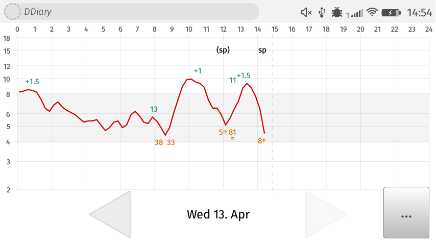
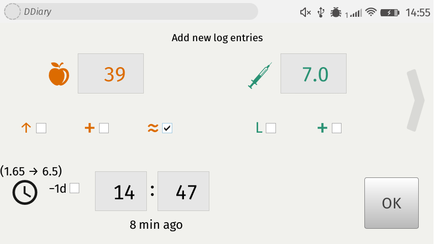
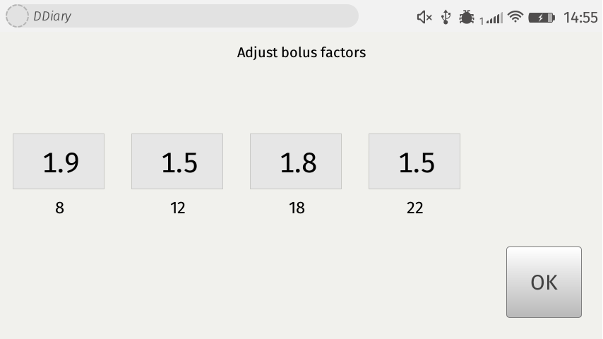
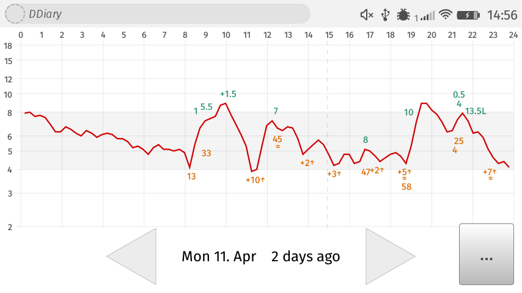

# DDiary

Type-1-Diabetes management tool for Firefox OS. Keep track of your carbs, insulin and blood glucose values. Import bg data from a Libre sensor to see correlations in the graph.

## Disclaimer

**Never** blindly trust any suggestions made by technology! Always consult a doctor before changing your therapy. This software is provided **without warranty of any kind**, for details see License file.

## Requirements

* Firefox OS (tested version 2.6)
* Micro SD card in your phone
* For the Libre-import: Python3 and the official Libre software on a Windows machine (might also work on Mac OS, untested)

## Installation

* Clone this repository and use Firefox WebIDE to install the app on your phone (connect phone to webIDE, open packaged app, press play)
* Disconnect your phone and restart the app, since the SD card cannot be used while usb is connected.

## Usage

### Adding log entries

* Double tap on the graph to open the log entry wizard.

* Enter carbs, insulin, fingerstick values or notes. Number inputs work by swiping them up and down.
* Adjust the time
* All non-zero values will be saved as log entries when hitting OK

### Import Libre sensor bg data

* Connect your Libre reader to your Windows PC
* Run `libre-import/import_libre_bgs.bat` (you might also want to create a start menu shortcut)
* The Libre Software should export csv, which our script converts and copies to the phone via usb

### Use bolus suggestions

* Press the ... button below the graph to adjust bolus factors for four times of day

* In the wizard, when you enter carbs, a bolus suggestion rounded to 0.5 IE is displayed, using a linearly interpolated bolus factor.

### Review previous days

* Press the arrow keys to navigate to previous days

